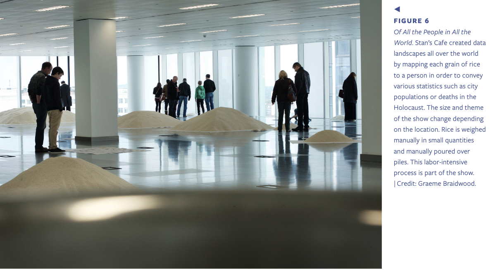
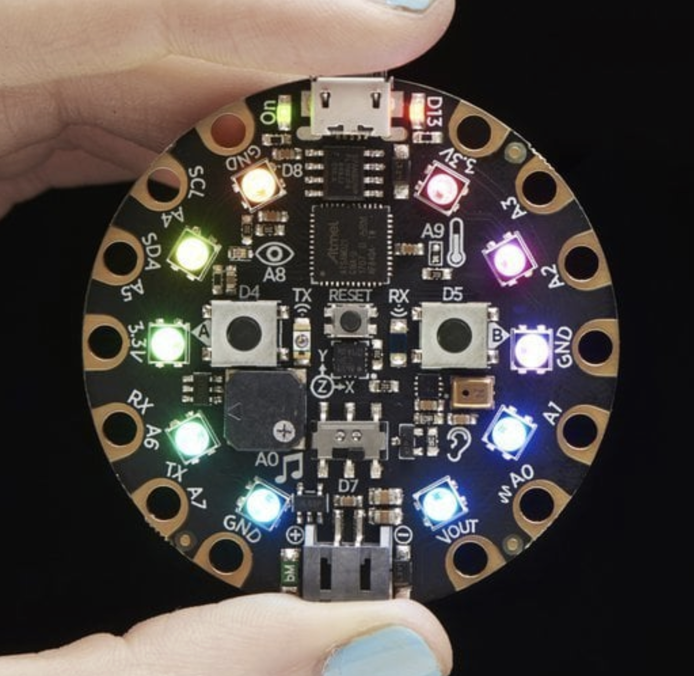

# data_representation_aub
A repo for workshop materials




## Workshop slides
[](https://docs.google.com/presentation/d/1AsWKkT2JVwwzPElJJ3eTW-O-f2DVIrblgDDbc8oOqC0/edit?usp=sharing
)


## Reference
### Books:   
[Dear data](https://libsearch.aub.ac.uk/cgi-bin/koha/opac-detail.pl?biblionumber=28723&query_desc=kw%2Cwrdl%3A%20dear%20data)     
[Making with data](https://libsearch.aub.ac.uk/cgi-bin/koha/opac-detail.pl?biblionumber=78847&query_desc=kw%2Cwrdl%3A%20making%20with%20data) 

### Research papers:    
[Data diaries: Exploring the meaning of data](https://dl.acm.org/doi/10.1145/3490149.3501319)     
[Data materialization: a hybrid process of crafting a teapot](https://dl.acm.org/doi/10.1145/3202918.3203087)                    
[Metaphors and `Tacit' Data: the Role of Metaphors in Data and Physical Data Representations](https://dl.acm.org/doi/10.1145/3623509.3633355)        
[See boat](https://www.untoldpossibilities.org/artboatandseeboat)     
[More seeboat](http://lauraperovich.com/projects/waterQuality.html)      

## Example data representations

[Global temps 1850-now](https://editor.p5js.org/cuvner/full/_V6MpEAHB)    
See the raw data [here](https://raw.githubusercontent.com/datasets/global-temp/main/data/monthly.csv)

[dynamic type generator](https://spacetypegenerator.com/).      
[kiel_m](https://www.kielm.com/).         


## P5JS
[Basic mapping exercise](https://editor.p5js.org/cuvner/sketches/PyhZJIYGJ)    
[3d_map_accel](https://editor.p5js.org/cuvner/sketches/aqRVIX0RY)       

## Recording data



### Text is data      
Representing the novel [Mobey Dick](https://editor.p5js.org/cuvner/full/_K0ISiq-4) as animated text      
[Kinetic typography](https://editor.p5js.org/cuvner/sketches/J4SpAboEH) using data captured from movement


## Processing sound
Paste this code into a new processing sketch. Click the screen to place circles


```java
import processing.sound.*;

// ========== SoundInput CLASS ==========
class SoundInput {
  AudioIn input;
  Amplitude rms;
  float sum = 0;
  float smoothingFactor = 0.25;

  void init(PApplet parent) {
    input = new AudioIn(parent, 0);
    input.start();

    rms = new Amplitude(parent);
    rms.input(input);
  }

  float update() {
    sum += (rms.analyze() - sum) * smoothingFactor;
    float rms_scaled = sum * (height / 2.0) * 5.0;
    return rms_scaled;
  }
}

// ========== ReactiveCircle CLASS ==========
class ReactiveCircle {
  PVector pos;
  float baseSize;
  float hueOffset;

  ReactiveCircle(float x, float y, float baseSize, float hueOffset) {
    pos = new PVector(x, y);
    this.baseSize = baseSize;
    this.hueOffset = hueOffset;
  }

  void display(float soundLevel) {
    float size = baseSize + soundLevel;

    // Cycle hue smoothly
    float hue = (frameCount + hueOffset) % 360;

    colorMode(HSB, 360, 100, 100, 100);
    fill(hue, 100, 100, 100);
    noStroke();
    ellipse(pos.x, pos.y, size, size);
  }
}

// ========== MAIN SKETCH ==========
SoundInput mic;
ArrayList<ReactiveCircle> circles;

void setup() {
  size(800, 600);
  colorMode(HSB, 360, 100, 100, 100);
  mic = new SoundInput();
  mic.init(this);
  mic.smoothingFactor = random(0.05, 0.5);

  circles = new ArrayList<ReactiveCircle>();
}

void draw() {
  background(0, 0, 10);
  float level = mic.update();

  for (ReactiveCircle c : circles) {
    c.display(level);
  }

}

void mousePressed() {
  float size = random(10, 80);
  float hueOffset = random(0, 360);
  circles.add(new ReactiveCircle(mouseX, mouseY, size, hueOffset));
}


```


